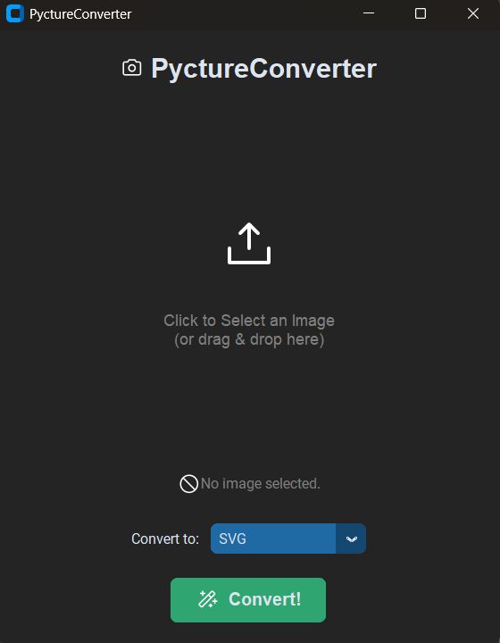

# PyctureConverter



A high-performance, minimalist image conversion utility built with Python, CustomTkinter, and vtracer. PyctureConverter allows you to effortlessly transform common raster images into high-quality scalable vectors (SVG) or other standard photography formats.

> **Note:** This is just a mini project made by me because I don't want to pay for an image conversion online.

## Key Features

- **Premium UI**: Modern, dark-themed interface built for a seamless user experience.
- **Vector Conversion**: High-quality SVG tracing powered by the vtracer engine.
- **Asynchronous Processing**: Non-blocking image conversion using background threading.
- **Batch-Ready Architecture**: Clean, modular source code designed for extensibility.
- **Format Support**: Convert between PNG, JPEG, WEBP, ICO, and SVG.

## Installation

### 1. Prerequisite

Ensure you have Python 3.9+ installed on your system.

### 2. Setup Virtual Environment

```powershell
python -m venv .venv
# On Windows
.venv\Scripts\activate
# On macOS/Linux
source .venv/bin/activate
```

### 3. Install Dependencies

```powershell
pip install -r requirements.txt
```

## Usage

Start the application by running the modular package from the root directory:

```powershell
# On Windows
python -m src.main
# On macOS/Linux
python3 -m src.main
```

1. **Select Image**: Click the large "Upload" area to select a source file.
2. **Choose Format**: Select your target format from the dropdown menu (SVG, PNG, etc.).
3. **Convert**: Click the "Convert!" button and wait for the success notification.

## Project Structure

```text
PyctureConverter/
├── src/                 # Core Source Code
│   ├── main.py          # Application Entry Point
│   ├── gui.py           # UI Components & Event Handling
│   └── engine.py        # Image Processing Logic
├── assets/              # Vector Icons & UI Assets
├── docs/                # Project Documentation & Screenshots
├── requirements.txt     # Dependency Definitions
└── README.md            # Project Documentation
```

## Built With

- [CustomTkinter](https://github.com/TomSchimansky/CustomTkinter) - Modern GUI widgets.
- [Pillow](https://python-pillow.org/) - Advanced image manipulation.
- [vtracer](https://github.com/visioncortex/vtracer) - Premium raster-to-vector engine.
- [tksvg](https://github.com/oandreev/tksvg) - Native SVG rendering for Tkinter.
- [Phosphor Icons](https://phosphoricons.com/) - High-quality vector icons.
